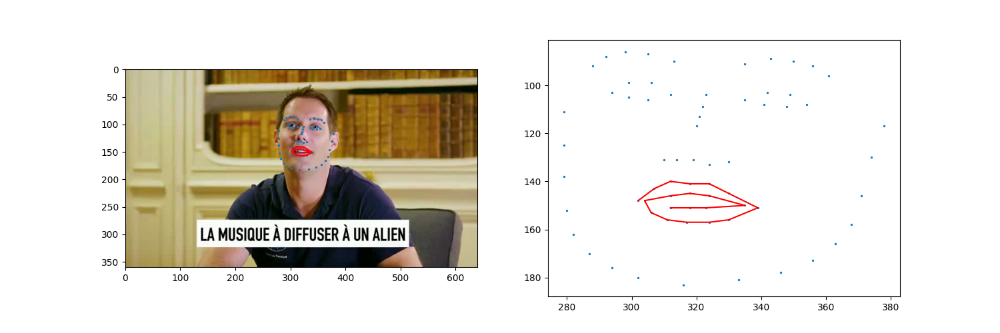
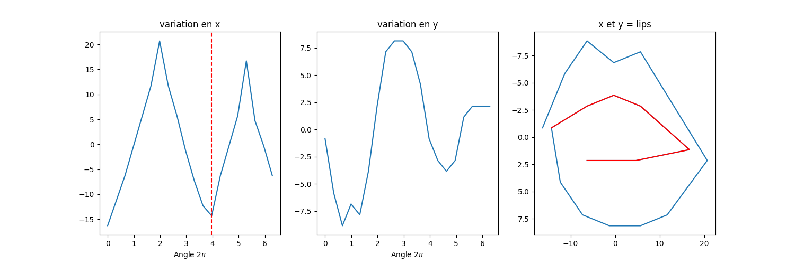
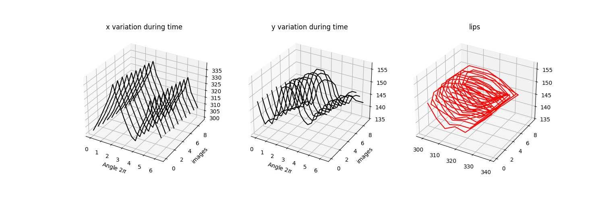
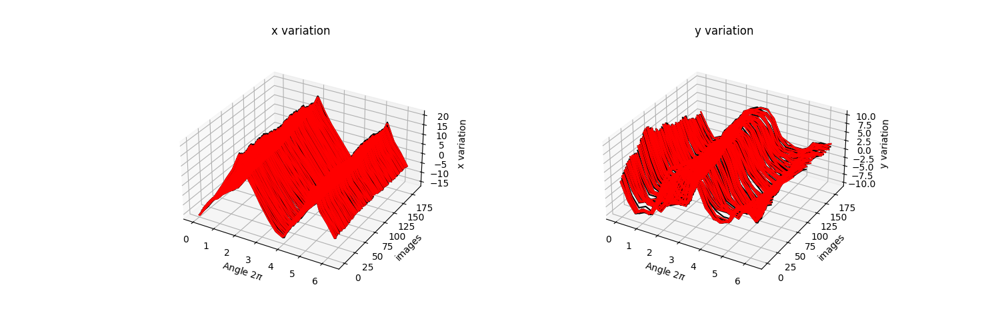
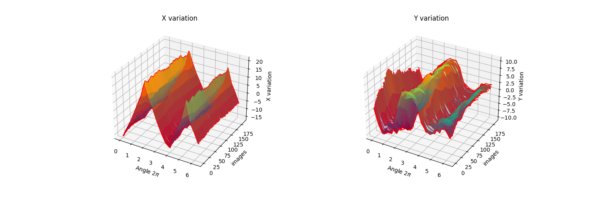
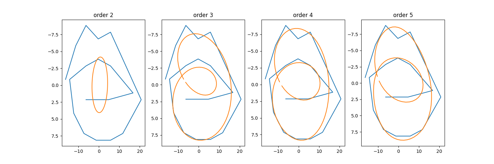
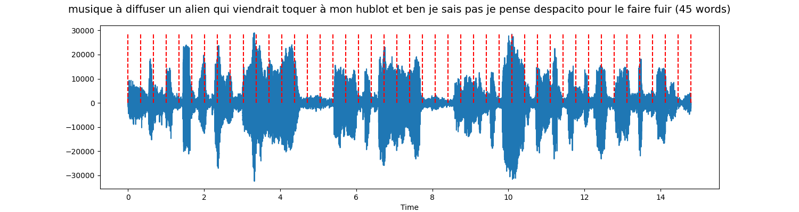

# **Read Lips**

**IA de détection de la sémantique d'une phrase par analyse du mouvement des lèvres**

L'objectif de ce dépôt est, dans un premier temps, de récolter et d'analyser les données nécessaires à la création de ce modèle. On analyse le mouvement des lèvres sur les images par rapport au temps (déroulé du film) en utilisant des modules de vision par ordinateur (InsightFace) et le son par des modules de NLP (interprétation du son).

## **Data Extraction**

Le module `createData.py` reçoit un film en entrée et applique une détection de visage à l'aide d'InsightFace afin d'obtenir les points du visage, y compris les lèvres. InsightFace prédit 60 points de visage, toujours classés dans le même ordre.

Les lèvres sont représentées par les points de la liste entre les numéros 48 et 68.

Ce module sépare les images du son et crée en sortie un fichier `.npy` qui contient les coordonnées de ces points pour chaque image, soit une matrice de dimensions `(nb_images, nb_points, 3)`, de type `int`, ainsi qu'un fichier `.wav` qui contient le son.

La détection du visage avec InsightFace prend un certain temps, c'est pourquoi on extrait les données de cette manière afin de ne plus avoir à relancer l'extraction des données. Ces fichiers sont stockés dans le répertoire `Datas`.

## **Data Cleaning Face**

Le module `readLips.py` récupère les données afin d'évaluer le mouvement des lèvres durant le film. La matrice de points du fichier `.npy` a une dimension fixe dans sa largeur (60 points) mais une dimension variable dans sa hauteur (le nombre d'images du film).

### **1. Extraction des coordonnées x et y des lèvres**

On extrait les points des lèvres (`lips = pts[48:68]`) et on calcule le centre de la bouche (`center = (np.mean(x), np.mean(y))`). On sépare ensuite les coordonnées x et y afin d'obtenir deux matrices `mat_x` et `mat_y`, représentant respectivement les variations en x et en y pendant le film.

Ces coordonnées sont visualisées avec Matplotlib 3D avec pour axes :
- **X** : la variable tau (2\*π) du module math.
- **Y** : le temps (numéro d'image).
- **Z** : la variation des coordonnées x ou y par rapport au centre de la bouche.

En dessinant des lignes continues entre les points des lèvres, on remarque que la bouche est représentée par une double boucle. La première boucle définit les points du bord supérieur de la lèvre, la deuxième définit les points du bord inférieur de la lèvre. La courbe en x marque deux pics : un pour chaque groupe (bord supérieur et bord inférieur) des lèvres. 

`mat_x` et `mat_y` représentent les variations des amplitudes durant le temps (nombre d'images). 

En effet, le son sera caractérisé par des "mots" (amplitudes fortes) et des "silences" (amplitudes faibles).

### **2. Interpolation des données : correction des dimensions**

On applique à ces deux matrices (`mat_x` et `mat_y`) une interpolation afin de créer une matrice de dimension constante en hauteur et en largeur. On peut ainsi choisir les dimensions des points des lèvres par rapport au temps, aussi bien par rapport au nombre de points (largeur) qu'au nombre d'images (hauteur).

Le module qui traite le son extrait les mots du fichier `.wav`. Cette interpolation permet donc de corréler les phases de mouvement des lèvres par rapport au nombre de mots.

L'interpolation se fait d'abord sur le nombre de points, en passant de 20 points initialement à 100 points, ce qui permet d'obtenir une courbe plus lisse en sortie. Cette première interpolation s'effectue avec la fonction `np.interp`. Pour l'interpolation en hauteur, on utilise `gridData` de Scipy, passant ainsi de 1280 images à un nombre de mots (ici 100 pour l'exemple).

On peut visualiser sous MatplotLib 3D le résultat de cette interpolation.

### **3. Modele mathématique : 2D-DFT**

Les amplitudes de mouvement des lèvres peuvent être représentées aisément avec une transformée de Fourier en deux dimensions (2D-DFT), très utilisée en traitement d'image. Cette transformée est particulièrement adaptée à la modélisation mathématique des amplitudes de mouvement. 

On travaille alors avec des nombres complexes, où la partie réelle représente la variation en x et la partie imaginaire la variation en y. En calculant les amplitudes de ces nombres, on affiche l'image spectrale, ce qui permet d'observer les amplitudes fortes (au centre de l'image spectrale) et les amplitudes faibles (aux bords de l'image spectrale). En appliquant un masque à cette image, on supprime les amplitudes faibles.

En sortie, on obtient un pourtour des lèvres lissé, donc plus propre schématiquement. Ce lissage est défini par l'ordre choisi pour la transformée de Fourier, autrement dit le nombre de nombres complexes que l'on choisit de garder.

On obtient alors une transformée de Fourier représentant les amplitudes de mouvement des lèvres par rapport au temps, avec des dimensions de matrice fixes, définies par l'ordre choisi pour la transformée.

Ce qui est intéressant avec cette interprétation par DFT, c'est qu'on peut définir une constante d'ordre, quel que soit le film, qui soit satisfaisante pour représenter le mouvement des lèvres.

Le fait de fixer le nombre de dimensions de la sortie permet aussi de préparer les données pour un apprentissage en deep learning.

### **4. Interprétation du résultat de la DFT**

Une transformée de Fourier est un modèle mathématique qui, comme tout modèle, modèlise des données par des coeficients. 

Plus le nombre de coeficients est important `on parle d'ordre plutot que degres`, plus la fonction sera callée aux données. 

Les premiers coeficients i=0 donne les coordonnées du centre d'inertie de la courbe. 

Les coeficients a et b pour i=1 donne les amplitudes maximales et c'est ce qui nous intéresse pour l'analyse des lèvres. 

En effet, lorsqu'une personne parle pour émettre un son la bouche s'ouvre et l'amplitude en y augmente. 

A l'inverse, lorsque la personne se tait, la bouche se ferme créant une amplitude en y plus faible. 

Evidement, les amplitudes en x sont importantes aussi car elle représentent la largeur de l'ouverture de la bouche. 

L'intérêt de la modélisation par Fourier est de pouvoir analyser les variations de ces amplitudes en évaluant les phases (dans le temps) où la bouche émet un son (forte amplitudes) et les phases où la bouche se tait (faibles amplitudes). 

Pour visualiser cela il suffit d'analyser les amplitudes maximales à chaque image dans le temps. 

## **Data Cleaning Sound**

Le module `speechReco.py` permet d'analyser le fichier `.wav`. Il extrait les données du son et les représente par rapport au temps (durée du film), puis les affiche à l'écran. Il interprète ce son (SpeechRecognition) afin de créer une chaîne de caractères qui donne la sémantique de ce qui a été dit sur cette bande son. En splittant cette chaîne de caractères par rapport aux espaces entre les mots, on définit le nombre de "mots" et le nombre de silences ("esp").

En appliquant une interpolation par `np.interp` sur le graphique du son, on obtient les phases de son par chacun des mots et des silences de la phrase prononcée. Enfin, une analyse par transformée de Fourier (FFT) permet de visualiser l'image spectrale du son. On visualise ainsi les sons forts (les mots) et les sons faibles (les silences). En supprimant les amplitudes faibles, on définit aussi un ordre constant, quel que soit le fichier son.

### **3. Synchronisation des données **

