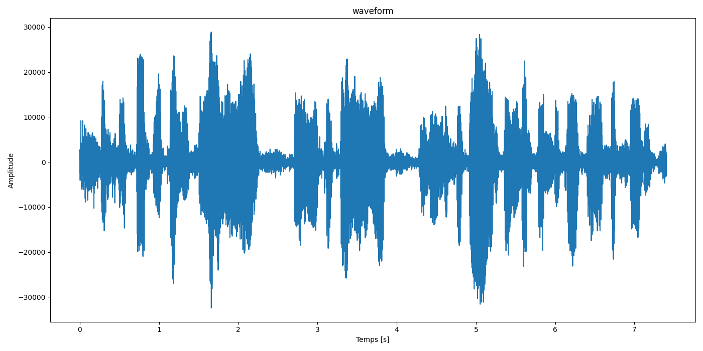
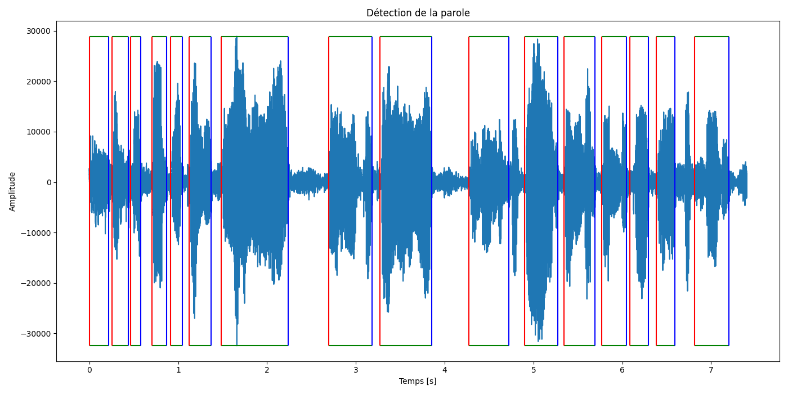
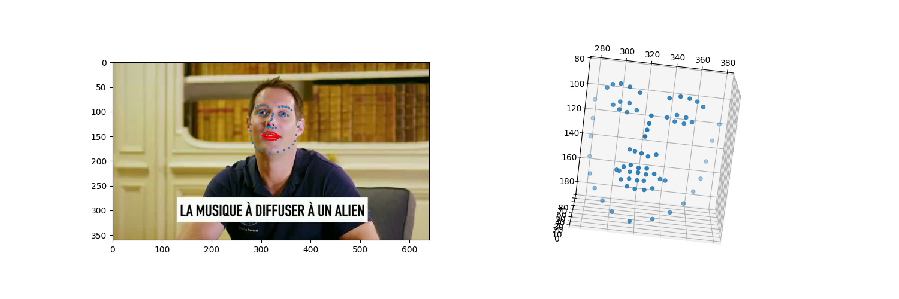
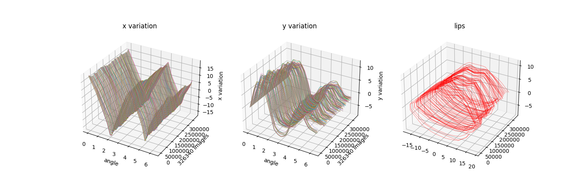
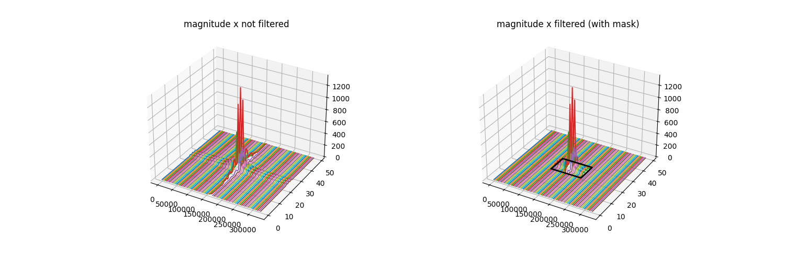
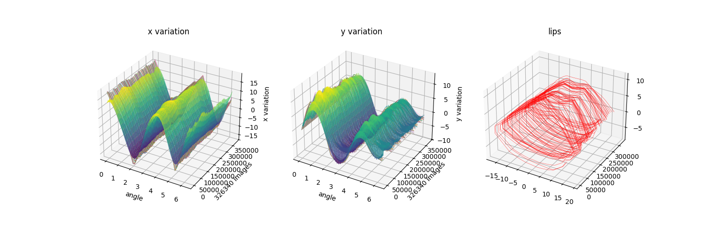

# **Read Lips**

**IA de détection de la sémantique d'une phrase par analyse du mouvement des lèvres**

Lorsque l'on lit sur les lèvres, on évalue visuellement les amplitudes d'ouvertures et de fermetures de la bouche afin de corréler cela avec des mots. 

Des modèles d'IA tels que InsightFace permettent de détecter le visage en fournissant les coordonnées des points des yeux, du nez, du menton et des lèvres en sortie de prédiction. 

Si l'on veut créer une IA permettant de lire sur les lèvres, il faut corréler les données lèvres avec la sémentique (les mots) du fichier son. 

En filmant une interview courte de Thomas Pesquier (video fournie dans ce repo), on applique InsightFace sur les images afin de détecter les points des lèvres et on sépare le fichier son (.wav) afin de l'analyser. 

# 1 : Data extraction.

Le module `createData.py` prend ce film, détecte les coordonnées des lèvres à chaque image et stocke cette donnée dans un fichier `.npy`. Il splite le son et stocke ces 2 données dans le dossier `datas/`. 

En effet, la détection du visage par InsightFace prend un certain temps. Ce module permet d'extraire les données sans avoir à relancer cette détection. 

Les modules d'analyse du visage sont placés dans le dossier `face/`, ceux du son dans le dossier `sound/`. 

# 2 : Analyse du son. 

Le module `soundAnalysis.py` prend le fichier `.wav`, prédit les mots et analyse le fichier son. 

La reconnaissance de la phrase s'effectue avec `pydub` qui fournit une chaine de charactères qui est la phrase prononcée. 

Dans notre interview de Thomas, la phrase est :

`musique à diffuser un alien qui viendrait toquer à mon hublot et ben je sais pas je pense despacito pour le faire fuir`. 

Si l'on split cette string par rapport aux espaces entre les mots, on obtient un total de 23 mots. 

Pour analyser le son en lui-même, on plot le son avec Matplotlib : on parle de waveform. 

Si l'on observe ce signal, on apercoit des phases de faibles amplitudes et des phases de fortes amplitudes. 

Les faibles amplitudes représentent les silences entre les mots qui sont, eux, représentés par les phases de fortes amplitudes. 

On appliquant une transformée de Fourier `Fast Fourier Transform`, on peux détecter ces phases. 

# 3 : Analyse des lèvres. 

InsightFace prédit 60 points de visage (landmarks). 

Les lèvres sont les points de cette liste situés entre les index 48 et 68, soit 20 points. 

Pendant l'interview, le visage bouge. On corrige cela en évaluant les points représentant la largeur maximale de la bouche. En calculant le centre de cette droite et en tournant tous les points de la lèvre afin que cette droite devienne horizontale, on replace chaque image des lèvres les unes derrière les autres. 

Si l'on veut corréler les images au son, il convient de faire une interpolation des lèvres afin d'otenir autant d'images que d'échantillons de son. Dans cet interview, le nombre d'échantillons de son est de 326340. 

Pour la modélisation mathématique qui va suivre, on interpole aussi le nombre de points qui constituent les lèvres en pasant de 20 points à 50. 

Donc si le film contient 1567 images, l'interpolation a pour objectif de passer d'une matrice de dimensions (1567, 20, 2) pour 1567 images, 20 points de 2 coordonnées (x et y) à une nouvelle matrice de dimensions (326340, 50, 2). 

Le module `interpolation.py` permet cela en appliquant la méthode gridData de numpy. 

Cette interpolation prend un peu de temps, c'est pourquoi ce module sauvegarde son résultat dans le fichier `mat_interp.npy` dans le dossier datas. 

Les lèvres sont donc stockées dans une matrice data_lèvres de dimension (326340, 50, 2) soit 326340 images de 50 points de 2 coordonnées (x et y). 

Cela permet de mieux appliquer la modélisation mathématique par transformée de Fourier. 

# 4 : Modélisation mathématique des lèvres. 

Comme nous voulons analyser des amplitudes, que ce soit pour les lèvres ou pour le son, le modèle le plus approprié est une transformée de Fourier. 

Pour les lèvres, nous avons une matrice, nous appliquerons donc une 2D-DFT dont l'algorithme est fourni par openCV. 

En effet, cette transformée est spécifique aux matrices car elle applique la transformée de Fourier aussi bien sur les rangées de la matrice que sur les colonnes. 

En split dans un premier temps la matrice data_lèvres en 2 sous matrices `mat_x` et `mat_y`. 

Si l'on considère un tour complet des lèvres comme étant $2\pi$, alors on peux représenter les variations de x et de y pour toutes les images avec Matplotlib3D. 

Sur chacune de ces matrices, on calcule la transformée de Fourier (la 2D-DFT) et on visualise l'image spectrale, c'est-à-dire l'amplitude des nombres complexes par rapport au fréquences. 

Cela nous permet de définir les dimensions du mask afin de ne garder que les hautes fréquences. 

On ne présente ici que l'image spectrale de la magnitude en x. 

Ce mask annule les faibles amplitudes selon des dimensions fixes : les ordres `ord_x` et `ord_y`. 

`ord_x` va avoir pour effet de lisser les contours des lèvres. 

`ord_y` va avoir pour effet de lisser les amplitudes. 

Si l'on découpe les transformées de Fourier avec ce mask, on se retrouve avec des matrices beaucoup plus petites :  

Pour `ord_x=5` et `ord_y=50000`, `four_x` et `four_y`, respectivement les transformées de `mat_x` et `mat_y`, ont une dimension de (100000, 10, 2) soit 8 fois plus petites. 

En appliquant la DFT inverse, on retrouve les lèvres. 

# 5 : la synchronisation des images et du son.

Maintenant que les données ont les mêmes dimension (il y a autant d'images que d'échantillons de son), on peut évaluer les variations des amplitudes des lèvres pendant une séquence donnée : un mot suivi d'un silence. 

