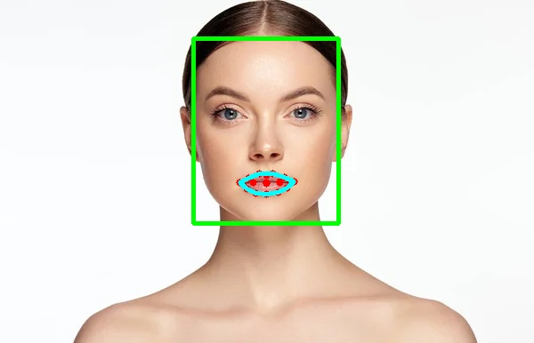
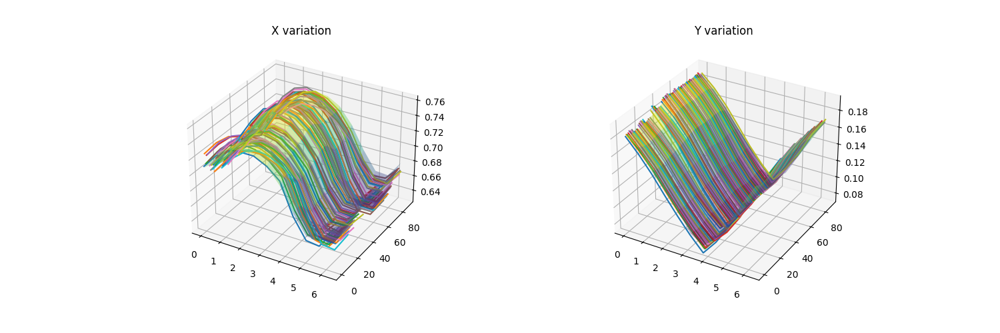
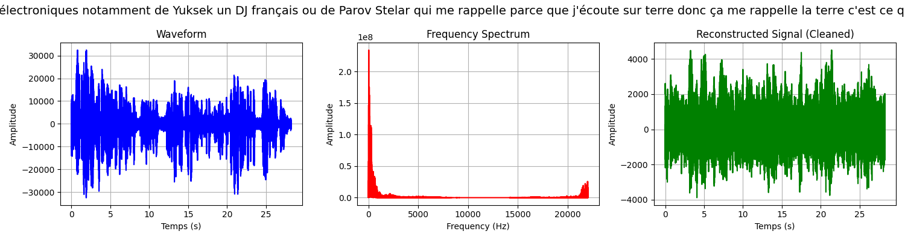

# ReadLips
AI model for lip reading.

## Collecting the Data: detectAudio.py

This module opens a window (webcam) and records frames and sound.

- **Input**: webcam
- **Output**: two files, one `.avi` for images and one `.wav` for soundtrack.

## Data Analysis for Images: detectFace.py

This module detects lips in images.

- **Input**: image from video
- **Output**: points of the lips

This module uses InsightFace to obtain landmarks of the lips from predictions. 
A convexHull of the points of the lips and an interpolation of this shape is used to have a constant number of points for this shape. 
It analyzes these points using a 2D DFT (Discrete Fourier Transform) to generate a function that represents mouth movements during speech.

- **X variation**: Variation in the x-values of the points.
- **Y variation**: Variation in the y-values of the points.
- The plotted surface represents the result of the 2D DFT.
- **Lips amplitude**: graphics of the lips during the movie in red (original points) in black (result of the DFT). 

These two surfaces are saved along with the Fourier coefficients.

## Data Analysis for Sound: speechReco.py

This module interprets sound.

- **Input**: WAV file
- **Output**: text (strings)

This module uses pydub to detect the sentence from the soundtrack. The sentence is a string containing all the words spoken in the audio. The soundtrack is visualized using matplotlib. Fourier analysis is employed to interpret the data.

## Deep learning : treatSignal.py

Now we have 2 functions :  
f(lips, t) represents the mouvement of the lips during the movie (time). 
f(sound, t) represents wave sound during the movie (time). 

These 2 functions are Fourier transforms : 2D DFT for lips, 1D FFT for sound. 

Because it's a movie, we are using a sequencial IA model : here LSTM. 

- **Input**: (row, col, 2) row is the number of the image (the time), col is the number of points (10), 2 is the number of values x and y. 
- **Output**: the sound signal. 
